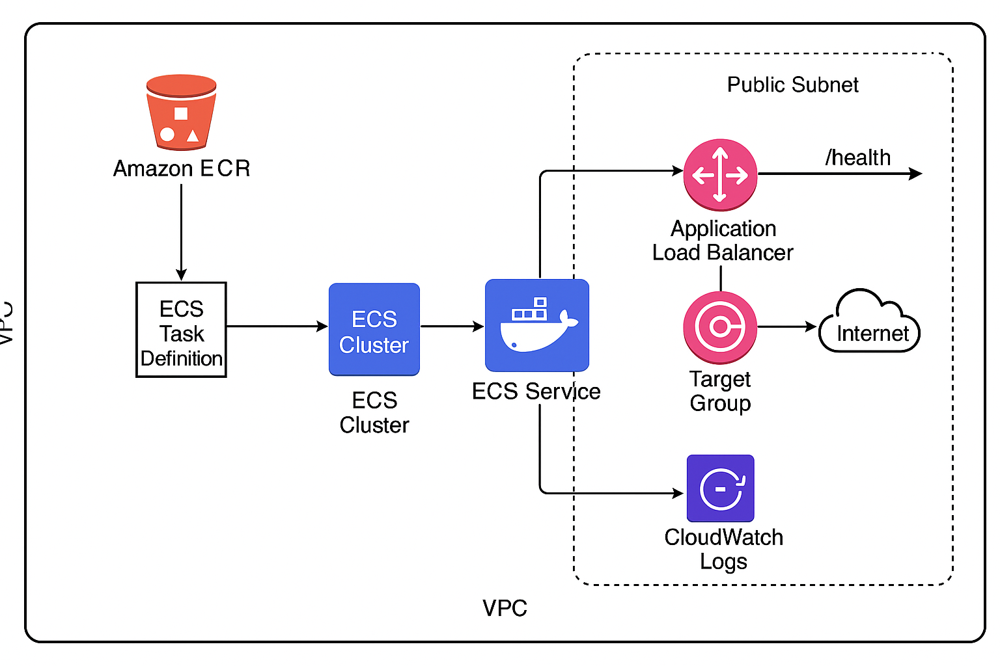
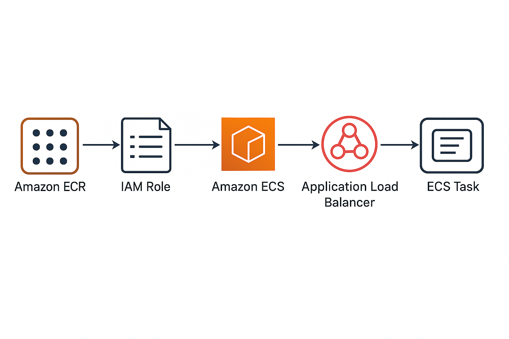

# 🚀 Terraform AWS ECS Fargate Deployment

This repository contains Terraform code to deploy a **Node.js application** on **AWS ECS Fargate** behind an **Application Load Balancer (ALB)** with container images stored in **Amazon ECR**.  

It provisions the entire infrastructure, including **VPC, public subnets, ECS cluster, task definitions, IAM roles, CloudWatch logging**, and **load balancing**.

---

## 📋 Features

- **VPC & Networking**
  - Custom VPC with public subnets
  - Internet Gateway & route tables for public access
- **Security**
  - Separate security groups for ALB and ECS tasks
  - ECS tasks only accessible via ALB
- **Container Deployment**
  - Amazon ECR repository
  - ECS Fargate task & service
- **Load Balancing**
  - Application Load Balancer (ALB) with target group
  - Health checks on `/health` endpoint
- **Monitoring**
  - CloudWatch log group for ECS containers
- **State Management**
  - Terraform remote state stored in S3 backend

---

## 🛠 Prerequisites

Before you begin, ensure you have:

1. **AWS CLI** installed and configured:
   ```bash
   aws configure
Terraform installed:


terraform -version
An S3 bucket for Terraform state (must be globally unique):


aws s3api create-bucket \
  --bucket <your-unique-bucket-name> \
  --region ap-south-1 \
  --create-bucket-configuration LocationConstraint=ap-south-1
Update the bucket name in main.tf:

terraform {
  backend "s3" {
    bucket = "<your-unique-bucket-name>"
    key    = "ecs/terraform.tfstate"
    region = "ap-south-1"
  }
}

Docker installed and running:


docker --version

Push your application Docker image to ECR:


# Authenticate Docker to ECR
aws ecr get-login-password --region ap-south-1 | \
  docker login --username AWS --password-stdin <AWS_ACCOUNT_ID>.dkr.ecr.ap-south-1.amazonaws.com

# Build the Docker image
docker build -t <AWS_ACCOUNT_ID>.dkr.ecr.ap-south-1.amazonaws.com/node-ecs-app:latest .

# Push to ECR
docker push <AWS_ACCOUNT_ID>.dkr.ecr.ap-south-1.amazonaws.com/node-ecs-app:latest
📂 Project Structure
plaintext
Copy
Edit
.
├── main.tf                # Backend config & AWS provider
├── network.tf             # VPC, subnets, IGW, route tables
├── ecs.tf                 # ECS cluster, service, task definition
├── variables.tf           # Input variables
├── terraform.tfvars       # Variable values
├── outputs.tf             # Terraform outputs
└── README.md              # Project documentation


🚀 Deployment Steps

1️⃣ Initialize Terraform
terraform init

2️⃣ Validate the configuration
terraform validate

3️⃣ Preview the changes
terraform plan

4️⃣ Apply the configuration
terraform apply -auto-approve


🔍 Verify Deployment

Get ALB DNS name: 


terraform output

Or from AWS Console → EC2 → Load Balancers → Your ALB → DNS name.

Access your application:


http://<alb-dns-name>

Check container logs:

aws logs tail /ecs/node-ecs-app --follow --region ap-south-1

🧹 Cleanup
To remove all AWS resources created by this Terraform code:


terraform destroy -auto-approve

Also, delete the S3 bucket manually if not needed:


aws s3 rb s3://<your-unique-bucket-name> --force


 

📌 Notes
The ECS tasks are running in public subnets with public IPs (for demo purposes). For production, consider using private subnets and keeping only the ALB in public subnets.

Health check path /health must be available in your application to ensure ECS service stability.

Security groups have been configured to allow HTTP (80) from the internet to ALB and 3000 only from ALB to ECS.

Terraform state is stored in S3 backend — do not delete this bucket unless you want to lose your state.

👨‍💻 Author
Harsh Kashyap
DevOps Engineer | AWS | Terraform | Docker | ECS | CI/CD
LinkedIn | GitHub